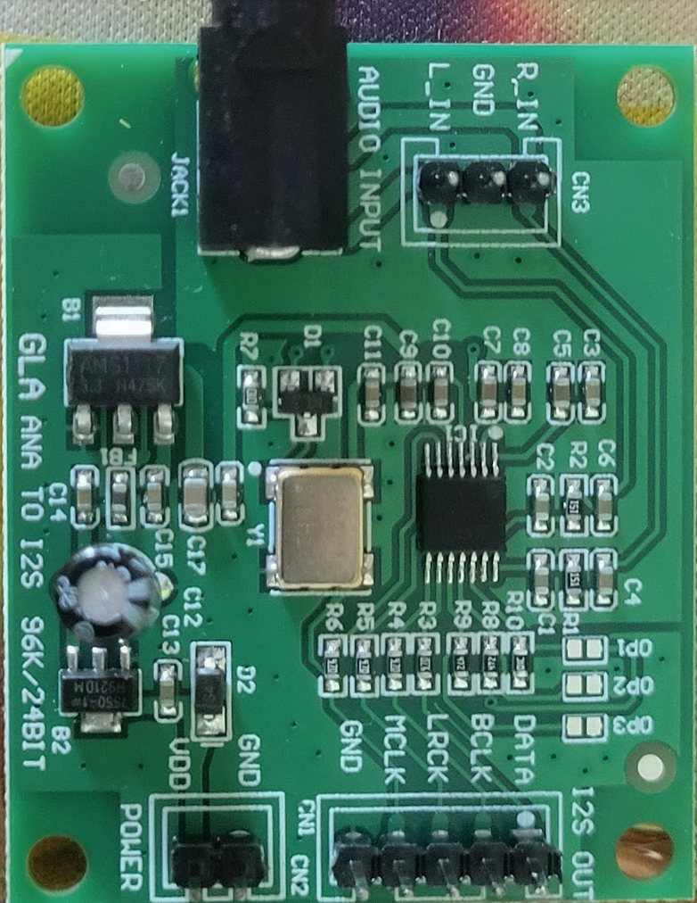
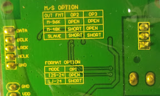
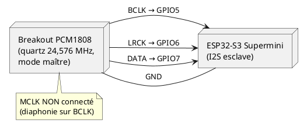

# PCM1808 → ESP32-S3 : capture audio I2S

Base de départ pour interfacer un breakout ADC stéréo **PCM1808** (carte marquée
« GLA ANA TO I2S 96K/24BIT ») avec un **ESP32-S3** sous ESP-IDF. Le firmware capture le flux
I2S 24 bits stéréo, le réduit en mono et affiche toutes les ~0,5 s le niveau (peak, RMS en dBFS,
min/max, nombre d'échantillons écrêtés) ainsi que quelques mots bruts — de quoi valider le
câblage et la chaîne avant d'y brancher un traitement réel.

Il est issu d'un projet de relais audio TV → aides auditives Bluetooth (ASHA), où il sert à
capter la sortie analogique de la TV. Ce dépôt ne contient que la partie capture, autonome.

La mise au point a été longue : ce breakout ne se comporte pas comme un PCM1808 « nu » qu'on
piloterait depuis le microcontrôleur. Les découvertes sont détaillées plus bas pour éviter de
refaire le même chemin.

## La carte breakout

| Face composants | Face arrière (options) |
|---|---|
|  |  |

Connecteurs :

| Connecteur | Broches |
|---|---|
| CN1 « I2S OUT » | GND, MCLK, LRCK, BCLK, DATA |
| CN2 « POWER » | VDD, GND |
| CN3 « AUDIO INPUT » | L_IN, GND, R_IN (en parallèle avec le jack JACK1) |

Points importants, visibles sur la face composants :

- **Y1 : oscillateur 24,576 MHz** qui fournit l'horloge système (SCKI) du PCM1808. La broche
  MCLK de CN1 n'est donc pas une entrée à piloter.
- Deux régulateurs (B1, B2). Nous l'alimentons en **5 V** sur CN2 et mesurons **3,3 V** sur
  l'alimentation numérique du PCM1808 : les sorties logiques sont en 3,3 V, compatibles avec
  l'ESP32 sans adaptation de niveau. (Le PCM1808 demande 5 V pour sa partie analogique.)

### Options (cavaliers à souder au dos : OP1, OP2, OP3)

Mode maître/esclave et fréquence d'échantillonnage :

| Mode | OP2 | OP3 | Horloges générées par le PCM1808 |
|---|---|---|---|
| **Maître 96 kHz** (réglage d'usine) | ouvert | ouvert | BCK 6,144 MHz, LRCK 96 kHz |
| **Maître 48 kHz** | court-circuit | ouvert | BCK 3,072 MHz, LRCK 48 kHz |
| Esclave | court-circuit | court-circuit | aucune : BCK/LRCK à fournir |

Format des données :

| Format | OP1 |
|---|---|
| **I2S 24 bits** (réglage d'usine) | ouvert |
| Cadré à gauche 24 bits | court-circuit |

Choix retenu : **maître 48 kHz (OP2 court-circuité), I2S 24 bits (OP1 ouvert)**.
- En maître, toutes les horloges dérivent du quartz de la carte : l'ESP32 n'a qu'à suivre.
  Le mode esclave obligerait l'ESP32 à générer des BCK/LRCK synchrones de ce quartz, ce qui
  revient au problème qui nous a occupés (voir plus bas).
- 48 kHz plutôt que 96 kHz : BCK deux fois plus lent, donc moins sensible à la diaphonie dans
  une nappe, et une décimation vers 16 kHz par 3 seulement.

> **État du firmware de ce dépôt** : réglé pour **maître 48 kHz (OP2 court-circuité)**, validé.
> Pour le réglage d'usine (96 kHz, tous les ponts ouverts), passer `I2S_SAMPLE_RATE_HZ` à `96000`
> dans `firmware/main/main.c` (également validé). En esclave I2S, l'ESP32 suit les horloges
> reçues : cette constante ne sert qu'à configurer le driver et l'affichage.

## Câblage

Testé avec un **ESP32-S3 Supermini** (broches sérigraphiées par numéro de GPIO).

| Breakout (CN1) | ESP32-S3 | Sens |
|---|---|---|
| BCLK | GPIO5 | PCM1808 → ESP32 |
| LRCK | GPIO6 | PCM1808 → ESP32 |
| DATA | GPIO7 | PCM1808 → ESP32 |
| GND | GND | commun |
| MCLK | **non connecté** | — |

Alimentation du breakout : 5 V sur CN2.

GPIO choisis pour éviter les broches de strapping de l'ESP32-S3 (0, 3, 45, 46), l'USB natif
(19, 20) et l'UART0 de la console (43, 44).



## Configuration I2S (ESP-IDF, driver `i2s_std`)

- `I2S_ROLE_SLAVE` : BCK et WS (LRCK) en entrées, MCLK inutilisé (`I2S_GPIO_UNUSED`).
- Format Philips, stéréo, **32 bits par slot** (`I2S_STD_PHILIPS_SLOT_DEFAULT_CONFIG(I2S_DATA_BIT_WIDTH_32BIT, I2S_SLOT_MODE_STEREO)`).
- Le PCM1808 sort un échantillon de 24 bits cadré à gauche dans chaque slot de 32 bits :
  valeur signée = `mot_brut >> 8` (décalage arithmétique). L'octet de poids faible des mots
  bruts doit valoir `0x00` — c'est un bon test de cohérence.
- `sample_rate_hz` doit correspondre à la fréquence imposée par la carte (96000 ou 48000).

## Construire et flasher

PlatformIO, framework ESP-IDF (testé avec ESP-IDF 5.5.2) :

```
cd firmware
pio run -t upload
pio device monitor
```

Adapter `upload_port` / `monitor_port` dans `platformio.ini`. Le Supermini utilisé a une flash
embarquée de 4 Mo alors que le préréglage `esp32-s3-devkitc-1` en suppose 8 : d'où
`board_build.flash_size = 4MB`.

## Résultats mesurés

Maître 96 kHz (réglage d'usine) :

| Condition | RMS | Pics |
|---|---|---|
| Entrées sans signal | -95 dBFS | -81 dBFS (bruit de fond normal d'un ADC 24 bits) |
| Musique, prise casque d'un PC à 10 % | ≈ -46 dBFS | ≈ -36 dBFS |
| Musique, prise casque d'un PC à 50 % | -24 à -36 dBFS | -12 à -24 dBFS, sans écrêtage |

Cadence vérifiée (48 128 échantillons en ~505 ms), 20 s consécutives sans bloc corrompu.

Maître 48 kHz (OP2 court-circuité) :

| Condition | RMS | Pics |
|---|---|---|
| Entrées sans signal | -92 dBFS | -80 dBFS |
| Musique, prise casque d'un PC à 50 % | -23 à -30 dBFS | -12 à -18 dBFS, sans écrêtage |

Cadence exacte (24 064 échantillons toutes les 500 ms), 15 s consécutives sans bloc corrompu.

## Ce qu'on a appris en route

1. **Ce breakout est maître par défaut.** Son quartz et ses options en font la source de toutes
   les horloges ; l'ESP32 doit être **esclave**. Nos premières versions configuraient l'ESP32
   en maître (BCK/LRCK/MCLK en sorties), comme pour un PCM1808 nu : les deux pilotaient les
   mêmes fils. Symptômes : niveau bloqué près de la pleine échelle quel que soit le volume
   (et même sans signal), motifs répétitifs dans les mots bruts (`0x7bde7bde`…), maximum
   identique au bit près d'un bloc à l'autre, aucun effet des changements de ratio MCLK.
   Le diagnostic final est venu de l'oscilloscope : DATA changeait sur une grille de 163 ns
   (= 1/6,144 MHz, le BCK du PCM1808 maître à 96 kHz), indépendamment de l'horloge de l'ESP32.
   La sérigraphie des options au dos l'a confirmé ensuite — **la lire en premier**.

2. **Ne pas câbler MCLK.** Inutile côté ESP32, et ce fil porte le 24,576 MHz du quartz. Dans
   une nappe, voisin de BCLK, il a corrompu BCK par diaphonie : perte de synchronisation
   (blocs arrivant toutes les 1,3–1,6 s au lieu de 0,5 s, valeurs figées). Fil retiré →
   capture stable.

3. **Horloge externe et diviseur 1 sur l'ESP32-S3** (essai intermédiaire, ESP-IDF 5.5.2) :
   avec `I2S_CLK_SRC_EXTERNAL` à 24,576 MHz et `mclk_multiple = 512` pour 48 kHz (diviseur
   MCLK = 1), la cadence obtenue était de 24 kHz. Avec `mclk_multiple = 256` (diviseur 2),
   elle était juste. Sans horloge présente sur la broche MCLK, `i2s_channel_enable()` bouclait
   indéfiniment (déclenchement du task watchdog).

4. **Pile de la tâche de capture** : avec 4096 octets de pile et un buffer de 2 Ko en variable
   locale, un débordement silencieux corrompait le tas ; le crash apparaissait plus tard, sans
   rapport apparent (dans le task watchdog de l'idle task). Buffer passé en `static`, pile à
   8192 octets.

5. **Mesures à l'oscilloscope** : des signaux logiques qui semblent centrés sur 0 V indiquent
   que les pinces de masse des sondes ne sont pas reliées au GND du montage. Corriger avant de
   juger formes et niveaux.

## Suite prévue

- Décimation 48 → 16 kHz (filtre passe-bas + un échantillon sur trois) pour un encodeur G.722.
- Envoi du flux vers un PC pour écoute.
